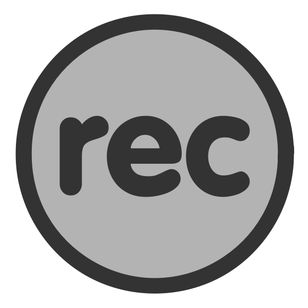

# Recordings {#recordings}

{width=3in}    

### Learning outcomes {-}  
1. Familiarize oneself with the structure of labs.    
2. Highlight key points described in the designcraft manual.  
3. Consolidate understanding of datasets provided.  

### Recorded exercises {-}  
Succinct tour of the key points articulated in the designcraft manual (and in some instances in slide decks supporting this guide).    

```{r, warning=FALSE, message=FALSE, echo=FALSE}
library(tidyverse)
recordings <- read_csv("./recordings.csv")
knitr::kable(recordings, booktabs = TRUE)

```

